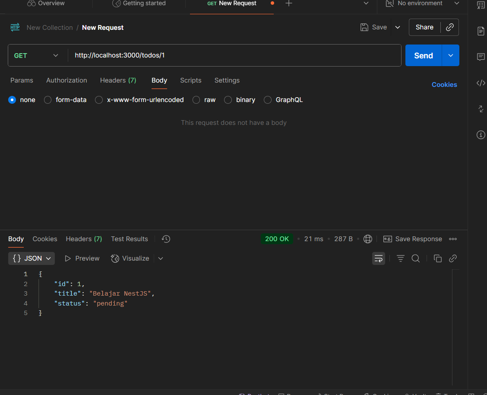
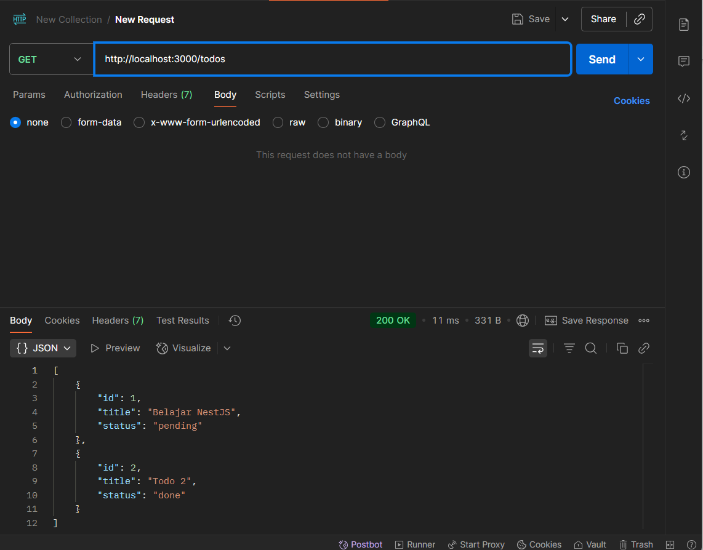
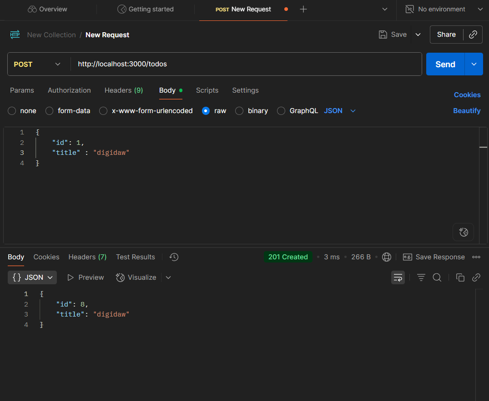
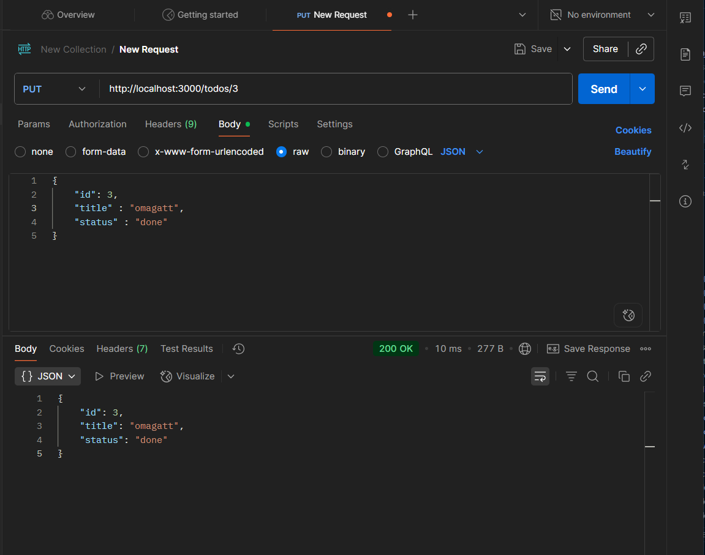
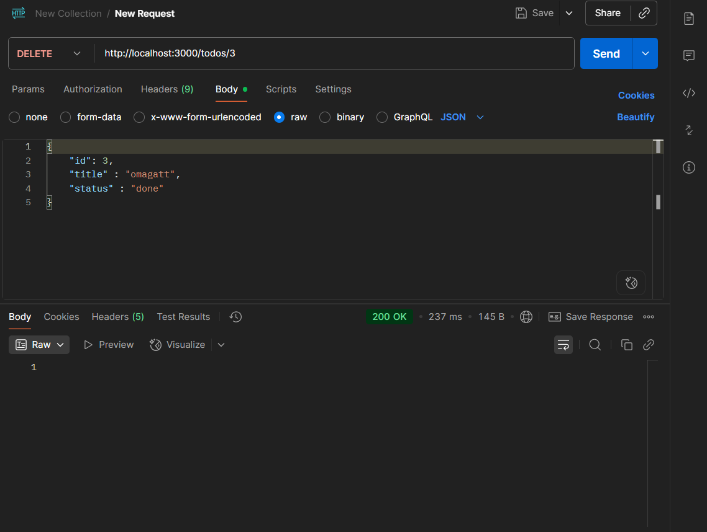

## Api Todo List Nest js

Api ini adalah implementasi sederhana todo list menguunakan *Nest JS* tanpa membuat database
semua data disimpan dalam array

## Identitas
Nama: Akira Saskara Hartono 
Kelas : XI RPL 1

# end point
| Method | Endpoint      | Deskripsi                       |
|--------|--------------|---------------------------------|
| GET    | /todos       | Menampilkan semua todo          |
| GET    | /todos/:id   | Menampilkan todo berdasarkan ID |
| POST   | /todos       | Menambah todo baru              |
| PUT    | /todos/:id   | Update todo berdasarkan ID      |
| DELETE | /todos/:id   | Hapus todo berdasarkan ID       |

# Lampiran Hasil

